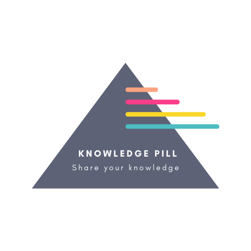

## 🔗 Knowledge Pill: an E-Learning and Skills - Sharing App
<br>
<!DOCTYPE html>
<html>
<body>
  <div>
    <a href="" rel="logo"></a>
    <p> 🖼 <b>Interactive Fun: resize both the height and the width of our fantabulous logo<br>that our most talented, LiviaBas designed for our Knowledge Pill project.🖼
  </div>
</body>
</html>
<br>

## _"Learning, Mentoring, and Collaborating to Unlock Our True Potential._

# _Advocating Digital Inclusion to Overcome the Digital Divide."_

<br>
<br>
REQUIRED INSTRUCTIONS:

1. To fork the repository, click here:
   <a href="https://github.com/LiviaBas/EducationApp"
   target="EducationApp" rel="noopener"><b>`EducationApp`</b></a>

[You can find the engineering project outline
here.](https://github.com/makersacademy/course/blob/master/final_projects/project_criteria.md)

2. The card wall is [here](https://trello.com/b/XjuYYhGM/final-project-team-education).

## How to contribute to this project

See [CONTRIBUTING.md](CONTRIBUTING.md)

## Quickstart

First, clone this repository. Then:

```
bash
> bundle install
> bin/rails db:create
> bin/rails db:migrate

> bundle exec rspec # Run the tests to ensure it works
> bin/rails server # Start the server at localhost:3000<b>
```

## Troubleshooting

If you don't have Node.js installed yet, you might run into this error when running rspec:

```
ExecJS::RuntimeUnavailable:
Could not find a JavaScript runtime. See https://github.com/rails/execjs for a list of available runtimes.
```

That is because Rails will use a Javascript runtime (such as Node) under the hood. The easiest way is to install Node by
running `brew install node` - and then run `bundle exec rspec` again.

2. **Licensing:** This project is licensed under the [GNU GPL v.3.0](https://www.gnu.org/licenses/gpl-3.0.en.html).

3. **Authors:** This repository is a joint project between its collaborators.

---

## Table of Contents

#### 1. Parsing User Stories

- [x] As a user,
      If I'm not signed in,
      I will be redirected to the sign up/login page
      <br>
- [x] As an unregistered user,
      So that I can use LearningApp
      I can sign up, using the sign up/login page
      <br>
- [x] As an unregistered user,
      so that I can't enter an invalid email address,
      I can see helpful information that indicates if an email is invalid
      <br>
- [x] As a registered user,
      So that I can use EducationApp,
      I would like to log in, using the log in page.
      <br>
- [x] As a logged in user,
      So that I can stop viewing and adding content,
      I would like to sign out.
      <br>
- [x] As a logged in user,
      So that I can see the user_content,
      I would like to access my courses.
      <br>
- [x] As a logged in user,
      So that I can choose a course, I would like to subscribe to a course
      and see it on my profile page.
      <br>
- [x] As a logged in user,
      So that I can only see relevant courses,
      I would like to delete a course.
      <br>
- [x] As an unregistered user,
      So that I can see a list of courses,
      I would like to access all the courses on the main page.

#### 2. Database Domain Modelling

- [x] Posts Table
- [x] Users Table

#### 3. MVP Planning

#### 4. Layout Planning

#### 5. Feature & Unit Testing

---

## Parsing User Stories<div>

### Headline Specifications

<!--Actions are _italic_. Nouns are **bold**. Attributes of nouns are **_bold italics_**.-->

##### User Story 01

&nbsp;&nbsp;&nbsp;As a **user,**<br>
&nbsp;&nbsp;&nbsp;If I'm not _signed in,_<br>
&nbsp;&nbsp;&nbsp;I will be _redirected_ to the _sign up/login page_<br>

##### User Story 02

&nbsp;&nbsp;&nbsp;As an **unregistered user,**<br>
&nbsp;&nbsp;&nbsp;So that _I can use_ **_LearningApp,_**<br>
&nbsp;&nbsp;&nbsp;I _can sign up, using_ **_the sign up/login page_**<br>

##### User Story 03

&nbsp;&nbsp;&nbsp;As an **unregistered user,**<br>
&nbsp;&nbsp;&nbsp;so that I _can't enter_ an **_invalid email address,_**<br>
&nbsp;&nbsp;&nbsp;I can _see helpful_ **information** that _indicates_ if an **_email_** is _invalid_<br>

##### User Story 04

&nbsp;&nbsp;&nbsp;As a **registered user,**<br>
&nbsp;&nbsp;&nbsp;So that I _can use_ **EducationApp,**<br>
&nbsp;&nbsp;&nbsp;I _would like to log in_, _using_ the **_log in page_**<br>

##### User Story 05

&nbsp;&nbsp;&nbsp;As a **logged in user,**<br>
&nbsp;&nbsp;&nbsp;So that I _can stop viewing and _adding content,_<br>
&nbsp;&nbsp;&nbsp;I _would like to sign out_<br>

##### User Story 06

&nbsp;&nbsp;&nbsp;As a _logged_ in **user,**<br>
&nbsp;&nbsp;&nbsp;So that I _can see_ the **user_content,**<br>
&nbsp;&nbsp;&nbsp;I would _like to access_ **my courses.**<br>

##### User Story 07

&nbsp;&nbsp;&nbsp;As a **logged in user,**<br>
&nbsp;&nbsp;&nbsp;So that _I can choose_ a **course,** I would like to _subscribe_ to a **course**<br>
&nbsp;&nbsp;&nbsp;and _see it_ on **_my profile page._**<br>

##### User Story 08

&nbsp;&nbsp;&nbsp;As a **logged_ in user,**<br>
&nbsp;&nbsp;&nbsp;So that _I can only see_ relevant **courses,**<br>
&nbsp;&nbsp;&nbsp;I _would like to delete_ a **course.**<br>

##### User Story 09

&nbsp;&nbsp;&nbsp;As an **unregistered user,**<br>
&nbsp;&nbsp;&nbsp;So that _I can see_ a **_list of courses,_**<br>
&nbsp;&nbsp;&nbsp;I would _like to access_ **_all the courses_** on the **_main page._**<br>

---

##### 'Nice to Have' Specifications

---

## Database Domain Modelling

The above user stories parse into several classes. As per [Class Responsibility
Collaborator](http://agilemodeling.com/artifacts/crcModel.htm)<br>modelling, there are two obvious classes:<br>**User** and **Post**


**Post**.

Class: **Post**


  New_User_and New_content                 Many Posts
| ------------------------------------- | ------------- |
| Knows own content                     |
| Knows own posts                       |
| Knows own user_name                   |
| Knows own creation                    |
| Knows edit time_date                  |
| <!-- Knows own creation time and date -->          
| <!-- Knows edit time and date -->           

Class: **User**

| Responsibility | Collaborators |One_of many Users
| ------------------------------ | ------------- |
| Knows own user_name            |               |
| Knows own user_email           |               |
| Knows own password             |               |
| Knows own posts                |               |
| <!-- Knows own profile pic url Post -->        |

Class: **User**

| Responsibility       | Collaborators |
| -------------------- | ------------- |
| Knows own user_name  |               |
| Knows own user_email |               |
| Knows own password   |               |
| Knows own posts      | Post          |
|______________________________________|
<br>

### Each class needs its own table, each with columns<br>
corresponding to the responsibilities of each class.<br>

#### Ruby Object Modelling helps us carry this task forward.<b>

Table: **Users**

| user_id | user_name | user_email   | user*password* |
| ------- | --------- | -------------| -------------- |
| User1   | Aquaman   | aquaman@.com | •••••••••••
| User2   |xx         | xxxx@.com    | •••••••••      | 
| User3   |xxx          xxxx@.com    | •••••          | 
_____________________________________|----------------|
|  Table: **Posts**
-------------------------------------
| post_id | user_id | post_content |
| ------- | ------- | ---------------|

<!-- Additional columns in Users: user_profile_pic, content_type -->
<!-- Additional columns in Posts: post_time, edit_time -->

---

## MVP Planning

- [ ] Homepage with a signup option
- [ ] Signup form
- [ ] Homepage with a login form and
- [ ] A 'remember me' login feature
- [ ] Tables to receive user data
- [ ] Page with post form for a new post,
- [ ] Users can upload/delete a photo for their profile picture
- [ ] Users can add/delete courses
- [ ] Users can add/delete star review ratings for courses
- [ ] Page with a list of posts with date and time posted
- [ ] Page with a list of courses available
- [ ] Users can create, edit, add, or delete their own
      courses, posts, subscriptions, and/or pictures.

---

## Layout Planning

- [x] Wireframe Signup Page
- [x] Wireframe Login Page
- [x] Wireframe New Post Page
- [x] Wireframe Add content to Page
- [x] Wireframe Add Courses
- [x] Wireframe Homepage
- [x] Wireframe Add Subscription form

---

## Feature & Unit Testing

Taking for example User Story 01 (`I would like to be able to sign up to Knowledge Pill`), this presupposes the ability to sign
up to become a user.

Creating these follows the TDD process:

1. Composition of pseudocode.
2. Composition of feature tests.
3. Composition of unit tests.
4. Composition of code.
5. Running of feature and unit tests.
6. Refactoring, and if necessary correction of code.

## STUDY WITH KNOWLEDGE PILL

<a href="https://knowledge-pill.herokuapp.com/login"
target="KnowledgePill" rel="noopener"><b>🔗`KnowledgePill`</b></a>


<br>We value your feedback, suggestions, questions, and thoughts.<br>
Share your thoughts here :)
<br>

